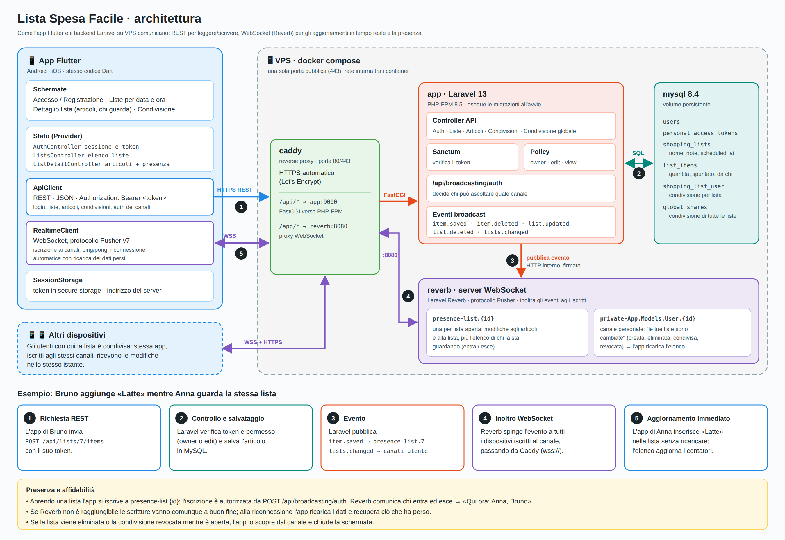

# Lista Spesa Facile

Liste della spesa condivise, ordinate per data e ora, con aggiornamento in tempo reale.

```
app/                Flutter (Android ora, iOS già predisposto)
backend/            Laravel 13 · Sanctum (token API) · Reverb (WebSocket)
docker-compose.yml  MySQL 8.4 + PHP-FPM 8.5 + Reverb + Caddy (HTTPS automatico)
```



Sorgente modificabile: [`docs/architettura.svg`](docs/architettura.svg).

## Funzionalità

- **Account**: registrazione e accesso con email e password, oppure con **Google, Facebook o Amazon**
  (token Sanctum salvato in modo sicuro sul dispositivo). I pulsanti Google e Facebook sono sempre visibili:
  se il server non è ancora configurato, toccandoli l'app spiega cosa manca (vedi sotto).
- **Aspetto** (stile "Mercato", `app/lib/theme/app_theme.dart`): fondo crema con i disegni dei prodotti ripetuti
  (`app/assets/backgrounds/`, versione chiara e scura) sotto tutte le pagine, card bianche arrotondate, titoli
  grandi in Fraunces e testi in Figtree (inclusi nell'app, `app/assets/fonts/`), verde bosco per le azioni e arancio
  per l'aggiunta. Nella prima pagina **LISTA SPESA FACILE** in piccolo e "Le mie liste" in grande, con i filtri
  *In programma* / *Passate* e una barra di avanzamento per ogni lista; nella lista aperta il nome in grande, i
  reparti con un pallino colorato e la barra scura sospesa per aggiungere i prodotti. **Chiaro o scuro** a scelta
  (menu del profilo → *Sfondo*: Chiaro, Scuro o Come il telefono), ricordato sul dispositivo.
- **Foto profilo**: dal menu con la tua foto in alto a destra nell'elenco delle liste (galleria o fotocamera,
  anche da rimuovere). La vede solo chi ha almeno una lista in comune con te.
- **Password dimenticata**: dalla schermata di accesso si riceve via email un codice di 6 cifre valido 30 minuti
  (5 tentativi); con codice e nuova password si entra subito e le altre sessioni vengono chiuse. Funziona anche
  per chi si era registrato con Google o Facebook e vuole una password.
- **Liste**: crea, modifica ed elimina liste con nome, data, ora e note. Il creatore sceglie (alla creazione o
  dopo) se chi ha il permesso di modifica può **cambiare anche il nome** della lista; altrimenti gli altri
  modificano articoli, note e data ma il nome resta bloccato. L'elenco è raggruppato per giorno
  (Oggi, Domani, …) e ordinato per data e ora; le liste passate sono in una sezione a parte.
- **Articoli**: aggiungi (quantità e peso o volume in g, hg, kg, ml, cl, l si scelgono con il pulsante ⚖ accanto
  al nome, che poi mostra il valore, es. "2 · 500 g"), modifica ed
  elimina; "Rimuovi articoli presi". **Eliminare** è distinto da **preso**: tenendo premuto un articolo (o con ⋮)
  si apre il menu con *Preso*, *Non trovato*, *Modifica*, *Foto* e, separato in rosso, *Elimina dalla lista*
  (con conferma, anche scorrendo verso sinistra o dal pulsante *Elimina* nella modifica).
  **Foto del prodotto** dalla galleria o dalla fotocamera, sia aggiungendolo (icona 📷 accanto al nome) sia
  modificandolo: compare come miniatura, ha la precedenza sul link esterno ed è visibile solo a chi vede la lista.
  **Dettatura** 🎤: si può dettare il prodotto ("2 kg di mele", "mezzo chilo di pane", "3 yogurt" → nome,
  quantità e peso compilati da soli) e il nome nella modifica.
  La dettatura usa il riconoscimento vocale di Google del telefono: se non funziona, controlla che l'app Google
  sia installata e attiva e che la lingua dell'app sia tra le lingue della voce (Impostazioni → Sistema → Lingue → Voce).
  **Lingue**: italiano, inglese, francese, tedesco e spagnolo. All'inizio l'app usa la lingua del telefono (se non è
  tra queste, l'inglese); si cambia da "Lingua" nella schermata di accesso o nel menu del profilo. Il server risponde
  nella stessa lingua (errori, reparti) e la salva sul profilo, così notifiche, promemoria ed email arrivano a
  ognuno nella propria lingua. I testi sono in `app/tool/l10n_strings.py`: dopo una modifica
  `python3 tool/l10n_strings.py && flutter gen-l10n`.
  **Suggerimenti** mentre scrivi: sotto il campo compaiono i prodotti che iniziano con quelle lettere ("lat" →
  🥛 Latte, 🥬 Lattuga…), prima quelli già messi nelle tue liste (dal più usato), poi i più comuni; a campo vuoto
  "Compri spesso". Tocca un suggerimento per scriverlo. Quelli già in lista non vengono proposti. Ogni articolo ha tre stati: *da prendere*,
  **preso** ✓ (casella a sinistra) e **non preso** ✗ (non trovato o esaurito, pulsante a destra); si vede chi
  l'ha segnato. Per ogni articolo si può scegliere un'**emoji** diversa da quella riconosciuta e un **link a
  un'immagine esterna**, mostrata come miniatura (toccala per ingrandirla).
- **Foto della lista**: dalla galleria o dalla fotocamera (menu ⋮ → *Aggiungi una foto*), visibile in cima
  alla lista e nell'elenco delle liste. Solo chi può modificare la lista la cambia.
- **Invia o esporta** (icona di condivisione): testo con spunte e reparti su **WhatsApp** o **Telegram**
  (scegli tu la chat), **PDF** con foto e caselle preso / non preso, oppure un'altra app.
- **Riconoscimento del prodotto**: dal nome il server capisce il reparto e assegna un'icona specifica
  (mele 🍎, latte 🥛, parmigiano 🧀, detersivo 🧴…, `app/Support/ProductCatalog.php`). Il reparto si può correggere
  a mano. Nella lista gli articoli sono **raggruppati per reparto** nell'ordine del giro al supermercato
  (Frutta, Verdura, Pane…) e, dentro ogni reparto, in **ordine alfabetico** (prima quelli da prendere).
- **Supermercato e prezzi**: alla creazione (o modifica) della lista si indica il supermercato, con i
  suggerimenti delle catene note. Se il server lo riconosce come catena ("Esselunga di viale Piave" → Esselunga,
  "Ipercoop" → Coop) ogni articolo mostra il **prezzo indicativo** di quella catena (moltiplicato per quantità e
  peso o volume) e in fondo alla lista c'è il **totale stimato** con l'asterisco: i prezzi sono indicativi in base
  alla distribuzione. Se il supermercato non è una catena nota non compare nessun prezzo. Il prezzo si ricalcola
  cambiando supermercato o aggiungendo e modificando un prodotto; i non trovati non contano nel totale.
  **Confronta catene** apre un popup con una riga per catena (nome, descrizione, totale): toccandola si vedono i
  prezzi articolo per articolo. Catene e prezzi sono sul server (`supermarkets`, `supermarket_prices`) e i prezzi
  si caricano da CSV (vedi *Prezzi delle catene*).
- **Condivisione**
  - *per lista*: con uno o più utenti registrati (tramite email), con permesso di modifica o sola lettura;
  - *globale*: tutte le tue liste, comprese quelle future, con uno o più utenti.
  Chi riceve una condivisione può abbandonarla. I destinatari si possono indicare già **alla creazione**
  della lista, ognuno con il proprio permesso.
- **Promemoria**: alla creazione (o modifica) scegli un avviso *10 minuti prima*, *1 ora prima* o
  *personalizzato* (da 1 minuto a 30 giorni) e chi avvisare: solo il creatore, solo i destinatari o tutti.
- **Chat** interna per ogni lista: si apre **sotto la lista**, nella stessa schermata (con una barra minima,
  solo icona e freccia per chiuderla), così mentre chatti puoi spuntare e aggiungere articoli.
  Accanto ai messaggi degli altri c'è la loro **foto profilo** (sagoma vuota se non l'hanno impostata). In tempo reale, anche per chi ha la sola lettura. Si possono inviare
  **foto** dalla galleria o dalla fotocamera (il testo scritto diventa la didascalia) e **dettare** i messaggi
  con il microfono. L'autore (o il proprietario della lista) può eliminare un messaggio tenendolo premuto.
  **Spunte** sui propri messaggi: ✓ verde = inviato, ✓✓ blu = arrivato sul telefono di tutti gli altri della
  lista (anche se non hanno ancora aperto la chat: basta che la notifica sia arrivata).
- **Notifiche** (campanella con il numero di non lette): lista condivisa con te, nuova lista di chi ti
  condivide tutto, condivisione globale ricevuta, promemoria, lista eliminata. Toccando una notifica si apre la
  lista (o la chat).
- **Notifiche stile WhatsApp** per chat e modifiche: ogni lista ha **una conversazione** sul telefono con le
  ultime righe ("Anna: sono al banco frigo", "Mario: ha preso 🥛 Latte", "Mario: ha eliminato 🍞 Pane"…).
  I messaggi suonano ogni volta, le modifiche solo alla prima (spuntare 20 articoli non fa 20 suoni). Chi fa la
  modifica non viene avvisato; chi ha la lista aperta nemmeno. Toccando la notifica si apre la lista (la chat se
  è un messaggio) e la conversazione sparisce. Non riempiono l'elenco della campanella.
- **In background e ad app chiusa** tutte le notifiche arrivano tramite **Firebase** (vedi sotto): senza Firebase
  arrivano solo finché l'app è aperta, perché Android chiude la connessione delle app in background.
- **Tempo reale** (Reverb, protocollo Pusher):
  - le modifiche agli articoli e alla lista compaiono subito su tutti i dispositivi che la stanno guardando;
  - sotto il titolo della lista compare **chi la sta guardando in questo momento** (canale presence);
  - l'elenco delle liste si aggiorna quando qualcuno crea, modifica, elimina o condivide;
  - se la lista viene eliminata o la condivisione revocata mentre è aperta, la schermata si chiude;
  - dopo una disconnessione l'app si riconnette da sola e ricarica i dati persi.

## Avvio del backend con Docker

```bash
cp .env.example .env
# Compila APP_KEY, DB_PASSWORD, DB_ROOT_PASSWORD, REVERB_APP_KEY, REVERB_APP_SECRET:
#   APP_KEY:  echo "base64:$(openssl rand -base64 32)"
#   REVERB_*: openssl rand -hex 16
docker compose up -d --build
```

Le migrazioni vengono eseguite automaticamente all'avvio del container `app`.

- In locale l'API risponde su `http://localhost/api` e il WebSocket su `ws://localhost/app/<REVERB_APP_KEY>`.
- Verifica: `curl http://localhost/api/config`

### Sul VPS

Sul VPS le porte 80 e 443 le tiene il proxy edge (repository `edge_vps`), condiviso con gli altri siti:
gestisce HTTPS e certificati e inoltra `listaspesafacile.com` e `api.listaspesafacile.com` al Caddy di
questo stack sulla rete `proxy-lsf`. Il Caddy di qui non pubblica porte.

1. DNS: record A di `listaspesafacile.com`, `www` e `api` verso l'IP del VPS.
2. Nel `.env`:
   ```
   COMPOSE_FILE=docker-compose.yml:docker-compose.edge.yml
   SITE_ADDRESS=:80
   SITE_HOST=listaspesafacile.com
   APP_URL=https://api.listaspesafacile.com
   CLIENT_KEY=<openssl rand -hex 24>
   REVERB_PUBLIC_HOST=api.listaspesafacile.com
   REVERB_PUBLIC_PORT=443
   REVERB_PUBLIC_SCHEME=https
   PHPMYADMIN_PORT=8082          # la 8081 è del phpMyAdmin di MagoPDF
   ```
3. La rete `proxy-lsf` deve esistere (`edge_vps/reti.sh`), poi `docker compose up -d --build`.

Aggiornamento dopo un `git pull`: `docker compose up -d --build`.
Log: `docker compose logs -f app reverb`.

### Aggiornamento automatico

`deploy/aggiorna.sh`, installato come `lsf-aggiorna` con un timer ogni 5 minuti (come `magopdf-aggiorna`): un
push su `main` arriva sulla VPS, viene ricostruito e riavviato. Se il sito, `/up` o `/api/config` (con la chiave)
non rispondono entro due minuti, torna all'immagine e al commit di prima. Le migrazioni già eseguite però non si
annullano: quelle che rinominano o cancellano colonne vanno pubblicate con attenzione.

```bash
/opt/listaspesafacile/deploy/aggiorna.sh --installa    # una volta sola
lsf-aggiorna --stato                                   # cosa c'è da prendere
tail -f /var/log/lsf-aggiorna.log
```

### Chi risponde a cosa

| Nome | Risposta |
|---|---|
| `listaspesafacile.com` | Sito vetrina, file statici da `site/` (Home, Privacy, Elimina account, Supporto) |
| `listaspesafacile.com/api/account-deletion/*` | Eliminazione dell'account dalla pagina del sito (codice via email), senza chiave |
| `api.listaspesafacile.com` | API e WebSocket, solo con `X-App-Key` uguale a `CLIENT_KEY`; senza → 404 vuoto |
| `api.…/auth/*` | Login social, aperto senza chiave (lo apre il browser di sistema) |
| `api.…/robots.txt` | `Disallow: /`, e `X-Robots-Tag: noindex` su ogni risposta dell'API |

In locale il sito si apre su <http://sito.localhost> e, con `CLIENT_KEY` vuota, l'API non chiede la chiave.

### Servizi

| Servizio | Ruolo |
|---|---|
| `caddy` | Reverse proxy: sito vetrina, controllo di `X-App-Key`, `/app/*` → Reverb, tutto il resto → PHP-FPM (HTTPS in locale no, sul VPS lo fa l'edge) |
| `app` | API Laravel (PHP-FPM), esegue le migrazioni all'avvio |
| `reverb` | Server WebSocket (`php artisan reverb:start`) |
| `worker` | Coda (`queue:work`): invia le notifiche push a Firebase senza rallentare le richieste |
| `scheduler` | `schedule:work`: ogni minuto invia i promemoria (`lists:send-reminders`); ogni giorno elimina le notifiche più vecchie di 90 giorni |
| `mysql` | Database (volume `mysql_data`): nessuna porta pubblicata, solo sulla rete interna `database` |
| `phpmyadmin` | Gestione del database via browser, in ascolto solo su `127.0.0.1:8081` del server |

### Reti e sicurezza del database

- `web`: Caddy, API, Reverb, worker e scheduler (con accesso a Internet, necessario per il login social e Firebase).
- `database` (`internal: true`): solo `mysql`, `app`, `worker`, `scheduler` e `phpmyadmin`. MySQL non è raggiungibile dall'esterno
  né da Caddy o Reverb, e non ha accesso a Internet.

### phpMyAdmin

Non è esposto su Internet. Dal tuo PC apri un tunnel SSH verso il VPS:

```bash
ssh -L 8082:127.0.0.1:8082 utente@89.58.9.88   # sul VPS PHPMYADMIN_PORT=8082
```

poi vai su <http://localhost:8082> ed entra con `DB_USERNAME` / `DB_PASSWORD` (o `root` / `DB_ROOT_PASSWORD`).
In locale basta aprire direttamente <http://localhost:8081>.

Gli eventi vengono inviati a Reverb in modo sincrono e "best effort": se Reverb non è raggiungibile
la modifica viene salvata comunque, e le app si riallineano quando si riconnettono.

## Email (recupero password)

Il codice per reimpostare la password parte via email. Con `MAIL_MAILER=log` (predefinito) l'email non viene
inviata ma scritta nel log (comodo in sviluppo): `docker compose logs app | grep -oE '\*\*[0-9]{6}\*\*'`.
Per inviarla davvero imposta un server SMTP nel `.env`, per esempio con Gmail (serve una *password per le app*):

```
MAIL_MAILER=smtp
MAIL_HOST=smtp.gmail.com
MAIL_PORT=587
MAIL_USERNAME=tuoaccount@gmail.com
MAIL_PASSWORD=<password per le app>
MAIL_FROM_ADDRESS=tuoaccount@gmail.com
```

poi `docker compose up -d`. Vanno bene anche Brevo, Mailgun, Amazon SES… (stesse variabili).

## Accesso con Google, Facebook e Amazon

Il login avviene tramite il server, quindi lo stesso meccanismo vale per tutti e tre i provider e sia per Android sia per iOS:

1. l'app apre `https://<dominio>/auth/<provider>/redirect` nel browser di sistema (Custom Tabs / ASWebAuthenticationSession);
2. il provider rimanda l'utente a `https://<dominio>/auth/<provider>/callback`; il server trova l'utente o lo crea;
3. il server riapre l'app su `listaspesafacile://auth?code=…` con un codice monouso valido 2 minuti;
4. l'app scambia il codice con il token (`POST /api/auth/social/exchange`) usando il `code_verifier` PKCE generato
   all'inizio: un'altra app che intercettasse il codice non potrebbe usarlo.

Al primo accesso l'account viene creato; se esiste già un utente con la stessa email, il profilo social viene
collegato a quell'account. Serve che il provider condivida l'email, perché è quella che si usa per condividere le liste.
Nell'app i pulsanti Google e Facebook sono sempre visibili; Amazon solo se configurato. Il server indica quali
sono attivi con `GET /api/config` → `social_providers`: finché ID e secret mancano nel `.env`, toccando il pulsante
l'app spiega che l'accesso non è ancora configurato.

Per ogni provider va registrata un'applicazione, poi ID e secret vanno inseriti nel `.env`.
**Callback** da autorizzare: `https://<dominio>/auth/<provider>/callback`.

| Provider | Dove | Cosa fare |
|---|---|---|
| Google | [Google Cloud Console](https://console.cloud.google.com/apis/credentials) → Credenziali | Configura la schermata di consenso, poi crea un *ID client OAuth* di tipo **Applicazione web** e aggiungi la callback tra gli *URI di reindirizzamento autorizzati*. → `GOOGLE_CLIENT_ID`, `GOOGLE_CLIENT_SECRET` |
| Facebook | [Meta for Developers](https://developers.facebook.com/apps) → Crea app → caso d'uso *Autenticazione* | In *Facebook Login → Impostazioni* aggiungi la callback agli *URI di reindirizzamento OAuth validi*; abilita l'autorizzazione `email`. ID e chiave segreta sono in *Impostazioni app → Di base*. Per usarlo con utenti reali, pubblica l'app. → `FACEBOOK_CLIENT_ID`, `FACEBOOK_CLIENT_SECRET` |
| Amazon | [Amazon Developer Console](https://developer.amazon.com/loginwithamazon/console/site/lwa/overview.html) → Login with Amazon | Crea un *Security Profile* e in *Web Settings* aggiungi la callback agli *Allowed Return URLs*. → `AMAZON_CLIENT_ID`, `AMAZON_CLIENT_SECRET` |

Dopo aver modificato il `.env`: `docker compose up -d` (i container rileggono le variabili).
I provider accettano come callback solo indirizzi HTTPS (o `http://localhost`): il login social dal telefono va quindi provato sul VPS o tramite un tunnel HTTPS (es. `cloudflared`).

## Notifiche push (Firebase, facoltative)

Senza Firebase tutto funziona lo stesso: con l'app aperta le notifiche arrivano in tempo reale e i promemoria
vengono programmati sul telefono come notifiche locali. Con Firebase arrivano anche **in background e ad app
chiusa** e i promemoria li invia il server.

Su Android il server manda push di soli dati ad alta priorità: l'app li riceve anche chiusa e disegna lei la
notifica, così chat e modifiche restano raggruppate per lista come in WhatsApp, e conferma la ricezione dei
messaggi (spunte blu). Su iOS le mostra direttamente il sistema. Se l'utente forza l'arresto dell'app dalle
impostazioni, Android non consegna più nulla finché non la riapre; su alcuni telefoni (Xiaomi, Huawei, Oppo…)
conviene togliere l'app dall'ottimizzazione della batteria.

1. Crea un progetto nella [Console Firebase](https://console.firebase.google.com/) (gratuito).
2. **App**: *Aggiungi app → Android*, package `it.listaspesafacile.lista_spesa_facile`. Scarica
   `google-services.json` in `app/android/app/`. Gradle applica il plugin Google Services solo se il file c'è.
3. **Server**: *Impostazioni progetto → Account di servizio → Genera nuova chiave privata*. Salva il file come
   `secrets/firebase-service-account.json` (la cartella è montata in sola lettura in `app`, `worker` e `scheduler`),
   poi `docker compose up -d`.
4. Verifica: `curl http://localhost/api/config` deve restituire `"push": true`.

L'app si registra con `POST /api/devices` dopo l'accesso e si scollega al logout. I token non più validi
vengono eliminati automaticamente.

## App Flutter

Richiede Flutter 3.47 o successivo.

```bash
cd app
flutter pub get
flutter run --dart-define=API_URL=http://10.0.2.2        # emulatore Android → backend locale
flutter run --dart-define-from-file=config/produzione.json            # server di produzione
flutter build apk --debug --dart-define-from-file=config/produzione.json
flutter build appbundle --release --dart-define-from-file=config/produzione.json
```

Senza `API_URL` l'app usa `https://api.listaspesafacile.com`. `config/produzione.json` non è nel repository:
si crea da `config/produzione.example.json` con la stessa `CLIENT_KEY` del `.env` del server.
`CLIENT_KEY` viaggia in `X-App-Key` con ogni richiesta, con le immagini e con l'apertura del WebSocket: senza, il
server di produzione risponde 404. La chiave si può estrarre dall'APK, quindi tiene lontani bot e curiosi ma non
sostituisce il login.

L'indirizzo del server si può cambiare anche dalla schermata di accesso (voce **Server**).
Su un telefono fisico in rete locale usa l'IP del PC, es. `http://192.168.1.20`.
I parametri del WebSocket vengono letti da `GET /api/config`, quindi nell'app va configurato solo l'indirizzo dell'API.

**iOS**: il progetto `app/ios` è già generato. Su un Mac: `cd app/ios && pod install`, poi `flutter build ios`
(o apri `Runner.xcworkspace` in Xcode per firma e pubblicazione).

## API

Tutte le rotte sono sotto `/api`. Le rotte protette richiedono `Authorization: Bearer <token>`.

| Metodo | Rotta | Descrizione |
|---|---|---|
| GET | `/config` | Parametri pubblici del WebSocket e provider social attivi |
| POST | `/register` | `name, email, password, password_confirmation` → `{token, user}` |
| POST | `/login` | `email, password` → `{token, user}` |
| POST | `/auth/social/exchange` | `code, code_verifier` → `{token, user}` (ultimo passo del login social) |
| POST | `/forgot-password` | `email`: invia il codice di 6 cifre (stessa risposta anche se l'email non esiste) |
| POST | `/reset-password` | `email, code, password, password_confirmation` → `{token, user}` |
| POST | `/logout` | Revoca il token corrente |
| GET | `/me` | Utente corrente (con `avatar_version`) |
| POST | `/me/avatar` | `image` multipart (jpg, png, webp, max 4 MB): foto profilo |
| DELETE | `/me/avatar` | Rimuove la foto profilo |
| GET | `/users/{id}/avatar?v=` | Foto profilo (te stesso o chi ha una lista in comune con te) |
| GET | `/lists` | Liste accessibili, ordinate per `scheduled_at` |
| POST | `/lists` | `name, scheduled_at, notes?, supermarket?, reminder_minutes?, reminder_target?, members_can_rename?, shares?: [{email, can_edit?}]` |
| GET | `/lists/{id}` | Lista con articoli e condivisioni; `supermarket_chain` = catena riconosciuta (null = niente prezzi), `price` di ogni articolo |
| PATCH | `/lists/{id}` | Modifica (proprietario o permesso di modifica), anche `reminder_minutes` (`null` = nessuno) e `reminder_target` (`owner`, `members`, `all`). Il nome solo se `can_rename`; `members_can_rename` solo il proprietario |
| DELETE | `/lists/{id}` | Elimina (solo proprietario) |
| GET | `/lists/{id}/image?v=` | Foto della lista (chi ha accesso; `v` = `image_version` della lista) |
| POST | `/lists/{id}/image` | `image` multipart (jpg, png, webp, max 8 MB; permesso di modifica) |
| DELETE | `/lists/{id}/image` | Rimuove la foto |
| POST | `/lists/{id}/items` | `name, quantity?, amount?, unit?, category?, custom_icon?, image_url?` (reparto e icona riconosciuti dal nome se `category` manca) |
| PATCH | `/lists/{id}/items/{item}` | `name?, quantity?, amount?, unit?, category?, status?, custom_icon?, image_url?, checked?, position?` (`status`: `todo`, `taken`, `missing`) |
| DELETE | `/lists/{id}/items/{item}` | Elimina articolo |
| DELETE | `/lists/{id}/items/checked` | Elimina gli articoli presi |
| GET | `/lists/{id}/items/{item}/image?v=` | Foto del prodotto (chi ha accesso; `v` = `image_version` dell'articolo) |
| POST | `/lists/{id}/items/{item}/image` | `image` multipart (jpg, png, webp, max 8 MB; permesso di modifica) |
| DELETE | `/lists/{id}/items/{item}/image` | Rimuove la foto del prodotto |
| GET | `/lists/{id}/shares` | Utenti con cui è condivisa |
| POST | `/lists/{id}/shares` | `email, can_edit?` (solo proprietario) |
| DELETE | `/lists/{id}/shares/{user}` | Revoca (proprietario) o abbandona (se `user` sei tu) |
| GET | `/global-shares` | `{shared_with, shared_by}` |
| POST | `/global-shares` | `email, can_edit?` |
| DELETE | `/global-shares/{user}` | Smetti di condividere con `user` |
| DELETE | `/global-shares/received/{user}` | Rinuncia alle liste di `user` |
| GET | `/lists/{id}/messages?before=` | Chat: 50 messaggi dal più recente + `has_more` + `delivered` (`{user_id: ultimo messaggio ricevuto}`) |
| POST | `/lists/{id}/messages/delivered` | `up_to`: il telefono ha ricevuto i messaggi fino a questo id (spunte blu) |
| GET | `/supermarkets` | Catene note (`name, description, has_prices`) |
| GET | `/lists/{id}/price-comparison` | Costo della lista in ogni catena con prezzi: `total, priced_count, items_count, current, items[{name, price}]` |
| GET | `/products/suggestions` | Prodotti da suggerire: già usati nelle liste accessibili (con `times`), poi i più comuni |
| POST | `/lists/{id}/messages` | `body` e/o `image` (multipart, max 8 MB): chiunque abbia accesso alla lista |
| GET | `/lists/{id}/messages/{message}/image` | Foto del messaggio (`has_image`) |
| DELETE | `/lists/{id}/messages/{message}` | Autore del messaggio o proprietario della lista |
| GET | `/notifications` | Ultime 50 notifiche + `unread_count` |
| POST | `/notifications/read` | `ids?`: segna come lette quelle indicate o tutte |
| DELETE | `/notifications` | Elimina tutte le notifiche |
| POST | `/devices` | `token, platform?`: registra il dispositivo per le notifiche push |
| DELETE | `/devices` | `token`: al logout |
| POST | `/broadcasting/auth` | Autorizzazione canali WebSocket |

Le date viaggiano in ISO 8601; il server le salva in UTC e l'app le mostra nel fuso del dispositivo.

### Prezzi delle catene

I prezzi indicativi si caricano da un CSV (virgole o punti e virgola; la prima riga può essere l'intestazione):

```
supermercato;prodotto;prezzo;per
Esselunga;Latte;1,29;l
Lidl;Banane;1,49;kg
Coop;Pasta;0,89;pz
```

`per` è `pz` (a confezione), `kg` o `l`. Il prodotto è riconosciuto come negli articoli (`ProductCatalog`: "Latte"
vale per ogni latte, "Pomodorini" per tutti i pomodori); le righe non riconosciute vengono saltate e segnalate. Una
catena sconosciuta viene creata.

```bash
docker compose exec app php artisan prices:import storage/app/prezzi.csv            # aggiunge o aggiorna
docker compose exec app php artisan prices:import storage/app/prezzi.csv --replace  # sostituisce i prezzi delle catene nel file
```

### Canali ed eventi WebSocket

| Canale | Eventi |
|---|---|
| `presence-list.{id}` | `item.saved`, `item.deleted`, `list.updated`, `list.deleted`, `message.created`, `message.deleted`, `messages.delivered` + membri presenti |
| `private-App.Models.User.{id}` | `lists.changed` (ricaricare l'elenco), `notification.created` (notifica + `unread_count`; con `stored: false` è un messaggio o una modifica da mostrare solo sul telefono) |

## Test

```bash
cd backend && php artisan test         # API, permessi, condivisioni, autorizzazione canali
cd app && flutter test                 # modelli e client API
```

Test end-to-end dell'app contro backend e Reverb veri (due utenti sulla stessa lista):

```bash
cd backend && php artisan serve & php artisan reverb:start & php artisan schedule:work &
cd app && flutter test --tags e2e --exclude-tags manual --run-skipped test/e2e
```

Con il backend Docker: `E2E_API_URL=http://localhost flutter test --tags e2e --exclude-tags manual --run-skipped test/e2e`.
Il test del promemoria aspetta il giro dello scheduler e dura circa un minuto e mezzo.
